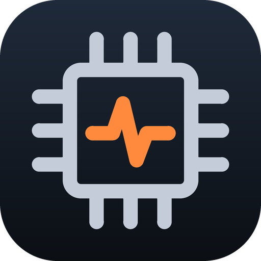

<div align="center">



# Stream Deck HWiNFO Monitor

**Live HWiNFO sensor readings, graphs and alerts on your Elgato Stream Deck.**

CPU and GPU temperatures, clocks, fan speeds, power draw and memory usage on any key, with smooth graphs, threshold alerts and Stream Deck Neo infobar support.

[](LICENSE)
[](CHANGELOG.md)
[](#requirements)
[](https://www.elgato.com/stream-deck)
[](https://www.typescriptlang.org/)
[](https://nodejs.org/)

</div>

---

## Screenshots

> Screenshots and a short demo are coming soon. Add your own to [`docs/screenshots/`](docs/screenshots/) and they will show up here.

<!--


-->

## Features

| Action | What it does |
|---|---|
| **Sensor Reading** | One sensor as a value, a graph, both, or a ring (donut) gauge. Smooth-line or bar graphs, EMA smoothing, update interval, decimals, MB → GB conversion, custom label, color, background and font. |
| **Composite Dashboard** | 2–4 readings on a single key with overlaid graphs and per-slot colors. |
| **Derived Metric** | Sum, average, maximum, minimum, delta or percent over 2–8 readings, with reusable presets. |
| **Infobar Carousel** | Cycles readings on the **Stream Deck Neo** infobar, one at a time with a sparkline or three side by side. |
| **Settings** | Connection status key, global poll rate (250 ms – 10 s) and the alert-rule library. |

**Alerts:** rules per sensor type with hysteresis, dwell time, cooldown, sticky mode and custom text (`{value}{unit}`). Press a key to snooze an alert for 5 min, 15 min, 1 h or until you resume it.

**Sensor picker:** search, category filter and favorites, shared across all keys.

**Lightweight:** one shared polling loop for all keys, read-only access to HWiNFO's shared memory, no network access and no files written.

## Requirements

- Windows 10 or 11, **64-bit (x64)**
- [Stream Deck](https://www.elgato.com/downloads) app **7.6** or newer (any Stream Deck model; the Infobar Carousel needs a **Stream Deck Neo**)
- [HWiNFO64](https://www.hwinfo.com/) (the free version works) with **Shared Memory Support** enabled

> The free HWiNFO version stops sharing memory 12 hours after it starts. If the Settings key shows **Waiting**, restart HWiNFO.

## Installation

### 1. Prepare HWiNFO

1. Open **HWiNFO64** → **Settings**.
2. Check **Shared Memory Support** (under *General / User Interface*).
3. Click **OK**, restart HWiNFO and keep it running in **Sensors** mode (minimized is fine).

Tip: enable **Auto Start** and **Minimize Sensors on Startup** so HWiNFO is always ready after boot.

### 2. Install the plugin

Download `com.recepemredev.hwinfo-monitor.streamDeckPlugin` from the [Releases](https://github.com/recepemredev/streamdeck-hwinfo-monitor/releases) page and double-click it. Stream Deck asks for confirmation, then a new **HWiNFO Monitor** category appears in the action list.

You can also build the package yourself, see [Building from source](#building-from-source).

### 3. First check

1. Drag **Settings** onto a key. It should turn green and show **Live** with the number of readings.
2. Drag **Sensor Reading** onto another key and pick a sensor in the panel on the right.

## Usage

- **Pick a sensor:** use the search box or the category filter. Click ☆ to mark a sensor as a favorite on every key.
- **Alerts:** open the **Settings** key and add rules, for example *Temperature at or above 85 °C*. Every Sensor Reading key showing that sensor type uses the rules unless *Alerts* is unchecked. When an alert fires, the key gets a colored border; press it to snooze.
- **Moving to another PC:** HWiNFO identifies sensors by IDs specific to the hardware, so sensors (and alert rules) must be picked again on a different computer.

### Troubleshooting

| Symptom | Fix |
|---|---|
| Settings key shows **Waiting** / "HWiNFO not detected" | HWiNFO is not running, Shared Memory Support is off, or the free version's 12-hour limit was reached. Restart HWiNFO. |
| A key shows `--` | The sensor is missing on this PC or hidden in HWiNFO. Pick it again. |
| Infobar Carousel is not in the list | The connected device is not a Stream Deck Neo. |
| Plugin does not install | Update the Stream Deck app to 7.6 or newer. |

Plugin logs are in `%APPDATA%\Elgato\StreamDeck\Plugins\com.recepemredev.hwinfo-monitor.sdPlugin\logs`.

## Building from source

Requires [Node.js](https://nodejs.org/) 20+ and Git.

```bash
git clone https://github.com/recepemredev/streamdeck-hwinfo-monitor.git
cd streamdeck-hwinfo-monitor
npm install
npm test            # unit tests (node:test)
npm run typecheck   # tsc --noEmit
npm run package     # → dist/com.recepemredev.hwinfo-monitor.streamDeckPlugin
```

For development, link the plugin folder to Stream Deck and reload it after each build:

```bash
npm run build
npx streamdeck dev
npx streamdeck link com.recepemredev.hwinfo-monitor.sdPlugin
npx streamdeck restart com.recepemredev.hwinfo-monitor
```

Restarting the Stream Deck app turns developer mode off; run `npx streamdeck dev` again if `restart` fails.

The plugin needs no environment variables, API keys or other secrets.

## Project structure

```
src/
├─ plugin.ts            Composition root: creates the poller and settings store, registers the actions
├─ plugin-id.ts         Plugin and action UUIDs
├─ hwinfo/              Shared-memory access (koffi), binary layout + parser, polling loop
├─ metrics/             Pure math: EMA smoothing, history, interval gate, unit conversion, derived ops
├─ alerts/              Threshold state machine (hysteresis, dwell, cooldown, sticky, snooze)
├─ settings/            Validation of untrusted Property Inspector input; global settings store
├─ render/              Pure SVG rendering of keys, composite, infobar and status; ImageSink
└─ actions/             Stream Deck SDK lifecycle: one LiveTile per visible key
tests/                  Unit tests per layer
scripts/                Packaging helpers (runtime staging of koffi)
com.recepemredev.hwinfo-monitor.sdPlugin/
├─ manifest.json        Stream Deck plugin manifest
├─ ui/                  Property Inspectors (plain HTML/JS, no framework)
├─ layouts/             Neo infobar layout
└─ imgs/                Icons
```

### Architecture

```
HWiNFO shared memory ──► SharedMemorySnapshotSource ──► Poller ──► TileAction ──► LiveTile ──► render/* ──► ImageSink ──► Stream Deck
                                                          ▲            ▲            │
                                    GlobalSettingsStore ──┴────────────┘            └─► metrics/*, alerts/*
```

- **One poller** reads HWiNFO at the global poll rate and publishes a `Snapshot` to every visible key.
- Each placed key gets a **LiveTile**. The tile samples its reading(s), updates its history and alerts, and renders an SVG.
- Layers depend on abstractions (`SnapshotSource`, `SnapshotFeed`, `GlobalSettingsChannel`, `GlobalSettingsFeed`), so everything except the native memory reader is unit-tested without Stream Deck or HWiNFO.
- Rendering is pure: the same model always produces the same SVG, and `ImageSink` skips frames that did not change.

## How it was built

This project was **vibecoded**: built through AI-assisted development, in a long back-and-forth between a human with a clear idea of what the keys should feel like and an AI coding assistant that did much of the typing. The human set the direction, reviewed every step, tested on a real Stream Deck Neo and kept pushing for clean structure (small single-purpose modules, no duplicated logic, tests for each layer).

It is an honest experiment in how far that workflow can go for a real, everyday tool. If you spot something odd, it is probably a good first contribution.

## Contributing

**You are welcome to fork this project and make it your own:** add sensors, new key styles, other devices, Linux/macOS backends, whatever you like. The MIT license lets you use, modify and redistribute it freely.

Pull requests are appreciated too. See [CONTRIBUTING.md](CONTRIBUTING.md) for the workflow and code style.

## License

[MIT](LICENSE) © 2026 Emre

*HWiNFO and Stream Deck are trademarks of their respective owners. This is an independent community project, not affiliated with or endorsed by REALiX (HWiNFO) or Elgato.*
